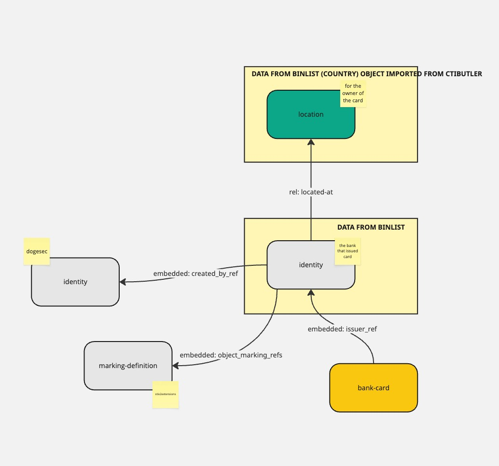

## creditcard2stix

This script contains logic to enrich a credit card number input with more information about the card (e.g. issuer, country, etc.).

The script takes a card number (required), card holder name (optional), expiry date (optional), security code (optional) as inputs (as a list) and outputs a range of STIX 2.1 objects for each credit card with added enrichment data.

The script requires an API key for [BIN/IP Checker](https://rapidapi.com/trade-expanding-llc-trade-expanding-llc-default/api/bin-ip-checker)



[Source](https://miro.com/app/board/uXjVKnlbRaY=/)

### Prerequisites

For `creditcard2stix.py` to work you need to set

* `CTIBUTLER_BASE_URL`: `'http://api.ctibutler.com'`
* `CTIBUTLER_API_KEY`:
    * If using `'http://api.ctibutler.com'`, [get your API key here](http://app.ctibutler.com). Can be left blank if running locally.
* `BIN_LIST_API_KEY`:
    *  for enriching credit card extractions needed for extracting credit card information. [You get an API key here](https://rapidapi.com/trade-expanding-llc-trade-expanding-llc-default/api/bin-ip-checker)

### Example usage

```bash
export BIN_LIST_API_KEY="<YOUR_RAPIDAPI_KEY>"
export CTIBUTLER_BASE_URL="<YOUR_CTIBUTLER_BASE_URL>"
export CTIBUTLER_API_KEY="<YOUR_CTIBUTLER_KEY>"
```

`creditcard2stix_quickstart.py`

```python
from stix2.serialization import serialize
from stix2extensions import PaymentCard
from stix2extensions.tools import creditcard2stix
import os

def main():
    card_data = {
        "card_number": "5596661232321231",
        "card_holder_name": "Adesola Ajayi",
        "card_expiry_date": "09/28",
    }

    bin_api_key = os.getenv("BIN_LIST_API_KEY")
    if not bin_api_key:
        raise SystemExit("Error: BIN_LIST_API_KEY is not set")

    ctibutler_url = os.getenv("CTIBUTLER_BASE_URL")
    ctibutler_key = os.getenv("CTIBUTLER_API_KEY")
    if not ctibutler_url or not ctibutler_key:
        print("CTI Butler not configured: issuer location enrichment will be skipped.")

    stix_objects = creditcard2stix.create_objects(card_data, bin_api_key)

    print("\n=== STIX Output ===")
    print(serialize(stix_objects, pretty=True))


if __name__ == "__main__":
    main()
```

### How it works

BIN Check have an API that allows you to pass parts of a bank card to get more data about it (e.g. bank issuer, bank location, etc.).

[You get an API key here](https://rapidapi.com/trade-expanding-llc-trade-expanding-llc-default/api/bin-ip-checker).

Their API accepts requests as follows;

```shell
curl --request POST \
    --url 'https://bin-ip-checker.p.rapidapi.com/?bin=5<CARD_NUMBER>' \
    --header 'Content-Type: application/json' \
    --header 'x-rapidapi-host: bin-ip-checker.p.rapidapi.com' \
    --header 'x-rapidapi-key: <API_KEY>' \
    --data '{"bin":"<CARD_NUMBER>"}'
```

e.g. for `5319031972219450327`;

```json
{
  "success": true,
  "code": 200,
  "BIN": {
    "valid": true,
    "number": 531903,
    "length": 6,
    "scheme": "MASTERCARD",
    "brand": "MASTERCARD",
    "type": "DEBIT",
    "level": "STANDARD",
    "currency": "USD",
    "issuer": {
      "name": "JACK HENRY & ASSOCIATES",
      "website": "http://www.jackhenry.com",
      "phone": "+14172356652"
    },
    "country": {
      "name": "UNITED STATES",
      "native": "United States",
      "flag": "🇺🇸",
      "numeric": "840",
      "capital": "Washington, D.C.",
      "currency": "USD",
      "currency_symbol": "$",
      "region": "Americas",
      "subregion": "Northern America",
      "idd": "1",
      "alpha2": "US",
      "alpha3": "USA",
      "language": "English",
      "language_code": "EN",
      "latitude": 34.05223,
      "longitude": -118.24368
    }
  }
}
```

This data can then be mapped to STIX 2.1 objects.

#### Automatically imported objects

These objects are imported from the URLs and generated by the STIX2 library into the filestore. This is done as they are included in the final bundle file generated by creditcard2stix.

* Extension Definition: https://raw.githubusercontent.com/muchdogesec/stix2extensions/main/extension-definitions/scos/payment-card.json
* Identity: https://raw.githubusercontent.com/muchdogesec/stix4doge/main/objects/identity/dogesec.json
* Marking Definition: https://raw.githubusercontent.com/muchdogesec/stix4doge/main/objects/marking-definition/stix2extensions.json

#### Credit Card number

Each credit card number in the input `.csv` file is compared to the BIN list API.

If a credit card number returns data from BIN list (where `valid=true`) then an STIX2 object is generated and stored in the filesytem (in the `stix2_objects` directory) with the following structure;

```json
{
    "type": "payment-card",
    "spec_version": "2.1",
    "id": "<payment-card--UUID V5>",
    "format": "<lookup->BIN.type>",
    "value": "<csv->card_number>",
    "scheme": "<lookup->BIN.scheme>",
    "brand": "<lookup->BIN.brand>",
    "currency": "<lookup->BIN.currency>",
    "issuer_ref": "<stix id of the identity object generated for linked bank>",
    "extensions": {
        "extension-definition--7922f91a-ee77-58a5-8217-321ce6a2d6e0": {
            "extension_type": "new-sco"
        }
    }
}
```

The UUID is generated using the namespace `00abedb4-aa42-466c-9c01-fed23315a9b7` (OASIS STIX namespace) and the `number` value.

If a credit card pattern does not match that of an entry from BIN list (response is not 200 or where `valid=false`) a STIX object is generated, but without any of the lookup fields present.

#### Bank Identity

For every unique bank_name and BIN.issuer.name and BIN.country.alpha2 a STIX 2.1 Identity object is generated as follows:

```json
{
  "type": "identity",
  "spec_version": "2.1",
  "id": "identity--<UUID V5>",
  "created_by_ref": "identity--9779a2db-f98c-5f4b-8d08-8ee04e02dbb5",
  "created": "2020-01-01T00:00:00.000Z",
  "modified": "2020-01-01T00:00:00.000Z",
  "name": "<BIN.issuer.name> (<BIN.country.alpha2>)",
  "identity_class": "organization",
  "sectors": [
  	"financial-services"
  ],
  "contact_information": "<BIN.issuer.website>",
  "object_marking_refs": [
  	"marking-definition--94868c89-83c2-464b-929b-a1a8aa3c8487"
  	"marking-definition--60c0f466-511a-5419-9f7e-4814e696da40"
   ]
}
```

The UUID is generated using the namespace `60c0f466-511a-5419-9f7e-4814e696da40` and the `name` value.

Note, if more than one credit card in the list has the same issuer (by name and country), only one Identity is created for it.

#### Bank Country

The bank country is then passed to CTI Butler to get the location of the bank.

The bank is joined to the location object imported as follows.

```json
{
    "type": "relationship",
    "spec_version": "2.1",
    "id": "relationship--<UUIDv5>",
    "created_by_ref": "identity--9779a2db-f98c-5f4b-8d08-8ee04e02dbb5",
    "created": "2020-01-01T00:00:00.000Z",
    "modified": "2020-01-01T00:00:00.000Z",
    "relationship_type": "located-at",
    "source_ref": "identity--<BANK IDENTITY STIX OBJECT>",
    "target_ref": "location--<CTIBUTLER LOCATION STIX OBJECT>",
    "description": "<BIN.issuer.name> is located at <LOCATION NAME>",
	"object_marking_refs": [
	  "marking-definition--94868c89-83c2-464b-929b-a1a8aa3c8487"
	  "marking-definition--60c0f466-511a-5419-9f7e-4814e696da40"
	]
}
```

uuid v5 namespace `60c0f466-511a-5419-9f7e-4814e696da40` values = `relationship_type`+`source_ref`+ `target_ref`
