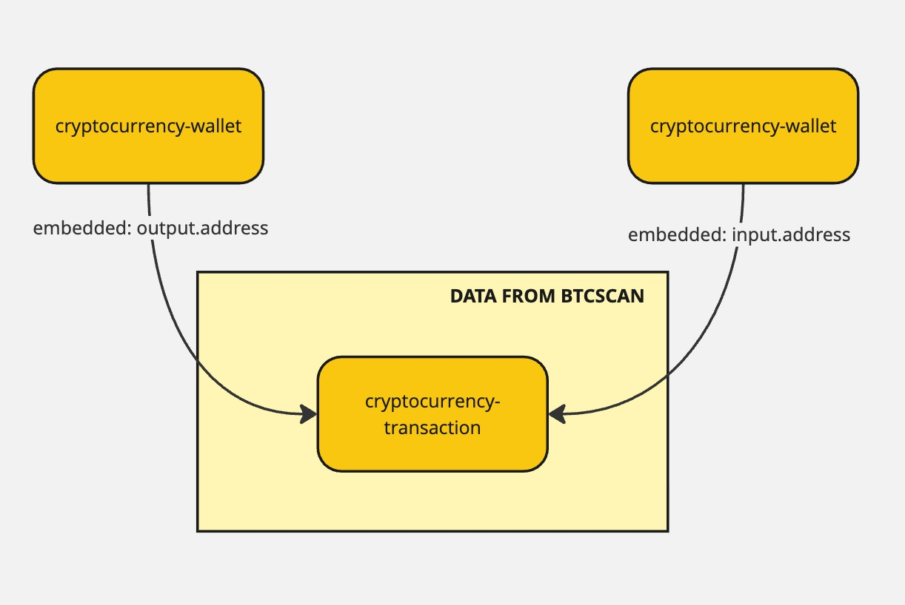

## crypto2stix

One of our tools, txt2stix, extracts bitcoin wallets from text.

Behind each wallet (and transaction) is wide variety of data.

Given the main use-cases of txt2stix is for threat intelligence research, this data can be incredibly useful (e.g. what transactions has a wallet had inflows?).

crypto2stix is designed to take a crypto transaction or wallet hash, enrich them with more data, and convert everything into STIX objects.



[Source](https://miro.com/app/board/uXjVKnlbRaY=/)

-----

### Example usage

```python

from stix2.serialization import serialize
from stix2extensions.tools import crypto2stix


def main():

    btc2stix = crypto2stix.BTC2Stix()

    wallet_objects = btc2stix.process_wallet(
        "3Cwgr2g7vsi1bXDUkpEnVoRLA9w4FZfC69", wallet_only=True
    )

    print("\n=== Wallet Output ===")
    print(serialize(wallet_objects, pretty=True))

    wallet_objects_with_transactions = btc2stix.process_wallet(
        "bc1qq262qrz4nh85c0jyt9shuaaa6sfphmxu2haa5m", wallet_only=False
    )

    print("\n=== Wallet (With Transactions) ===")
    print(serialize(wallet_objects_with_transactions, pretty=True))

    transaction_objects = btc2stix.process_transaction(
        "bf5537667863bc9557fd2aabc22d49916b37ef1f058e585683f82c31195c13e6"
    )

    print("\n=== Wallet (With Transactions) ===")
    print(serialize(transaction_objects, pretty=True))


if __name__ == "__main__":
    main()
```

-----

### BTCScan

https://btcscan.org/ provides details about bitcoin transactions.

e.g.

get a transaction by tx id: https://btcscan.org/api/tx/d63a3757a2a7b4c58e49f5a2e4236b1d4cbc2e4ffc9aa04c636707cb0bbbee7b

```json
{
  "txid": "d63a3757a2a7b4c58e49f5a2e4236b1d4cbc2e4ffc9aa04c636707cb0bbbee7b",
  "version": 1,
  "locktime": 0,
  "vin": [
    {
      "txid": "57a2bd4e0a7b318b79550c4d7fde5813564637a01b5131dd3bc7ad81e9b84872",
      "vout": 1,
      "prevout": {
        "scriptpubkey": "76a914b514578153fa240bfc568d6d042335914c50ab4d88ac",
        "scriptpubkey_asm": "OP_DUP OP_HASH160 OP_PUSHBYTES_20 b514578153fa240bfc568d6d042335914c50ab4d OP_EQUALVERIFY OP_CHECKSIG",
        "scriptpubkey_type": "p2pkh",
        "scriptpubkey_address": "1HWTg6YPnbb4DoPqmY8bwFr6s8BoHyAVBf",
        "value": 11845608
      },
      "scriptsig": "483045022100b107ae12209e86cee676940436f6778bc29d54a0e4047f1b367c10959f61a0fb022045ce67f745f67f6d4033216eb0e5d78549db675abbb0bdf4e257700ea68394ad012102b0eb710c74a391c8e964d72b3361871d25191c87f1c9a8e42f7ee79bbf2bda49",
      "scriptsig_asm": "OP_PUSHBYTES_72 3045022100b107ae12209e86cee676940436f6778bc29d54a0e4047f1b367c10959f61a0fb022045ce67f745f67f6d4033216eb0e5d78549db675abbb0bdf4e257700ea68394ad01 OP_PUSHBYTES_33 02b0eb710c74a391c8e964d72b3361871d25191c87f1c9a8e42f7ee79bbf2bda49",
      "is_coinbase": false,
      "sequence": 4294967295
    },
    {
      "txid": "86e08603d1dd3d0c40be6c05613438d3ee1f230cdde754ab9cbb1fb70e87079b",
      "vout": 1,
      "prevout": {
        "scriptpubkey": "76a914d4a013f66ea64c5a7535626ed7d740834bfcb1a488ac",
        "scriptpubkey_asm": "OP_DUP OP_HASH160 OP_PUSHBYTES_20 d4a013f66ea64c5a7535626ed7d740834bfcb1a4 OP_EQUALVERIFY OP_CHECKSIG",
        "scriptpubkey_type": "p2pkh",
        "scriptpubkey_address": "1LPG25hYrc91YgoBqrZwkqg7xapLX5GQGe",
        "value": 5464724
      },
      "scriptsig": "4730440220440d8f90d0feb3a795122a38f24904103abe47620b0c83eca96de616015a93e002205afc3099b5e7cd4b93add77496be979c3263842dd15a669b5deacbfbfe48b249012102c9161829e8e774355f09b5fe0b7a0227076d7d843bcace78cf4dd275aceaf368",
      "scriptsig_asm": "OP_PUSHBYTES_71 30440220440d8f90d0feb3a795122a38f24904103abe47620b0c83eca96de616015a93e002205afc3099b5e7cd4b93add77496be979c3263842dd15a669b5deacbfbfe48b24901 OP_PUSHBYTES_33 02c9161829e8e774355f09b5fe0b7a0227076d7d843bcace78cf4dd275aceaf368",
      "is_coinbase": false,
      "sequence": 4294967295
    }
  ],
  "vout": [
    {
      "scriptpubkey": "76a91400e8fd98ca34f195b020af4a8b1c7238663d421288ac",
      "scriptpubkey_asm": "OP_DUP OP_HASH160 OP_PUSHBYTES_20 00e8fd98ca34f195b020af4a8b1c7238663d4212 OP_EQUALVERIFY OP_CHECKSIG",
      "scriptpubkey_type": "p2pkh",
      "scriptpubkey_address": "115p7UMMngoj1pMvkpHijcRdfJNXj6LrLn",
      "value": 17171661
    },
    {
      "scriptpubkey": "76a9149872ea5a955b2148b2092d4b5934cdb91c70efb188ac",
      "scriptpubkey_asm": "OP_DUP OP_HASH160 OP_PUSHBYTES_20 9872ea5a955b2148b2092d4b5934cdb91c70efb1 OP_EQUALVERIFY OP_CHECKSIG",
      "scriptpubkey_type": "p2pkh",
      "scriptpubkey_address": "1Eu5Nd9mx3qXn52gKy7zTQRvgXcHeQCfwa",
      "value": 88671
    }
  ],
  "size": 373,
  "weight": 1492,
  "fee": 50000,
  "status": {
    "confirmed": true,
    "block_height": 466967,
    "block_hash": "000000000000000000140c66ec9e8af37a881a0bf6ef6a0cb123db7861f7dc0b",
    "block_time": 1495108523
  }
}
```

get all transactions by wallet id: https://btcscan.org/api/address/115p7UMMngoj1pMvkpHijcRdfJNXj6LrLn/txs/chain

```json
[
  {
    "txid": "14449446275da0bf11825d14733fcc28f7264f8a2c3a506752f92fddb8e1aa16",
    "version": 1,
    "locktime": 0,
    "vin": [
      {
        "txid": "80b67ae56b8884b327407ed9e9e63db0240a018ee4f1475fb6d027a12bb4e1f5",
        "vout": 5,
        "prevout": {
          "scriptpubkey": "76a914dba6d09a4cc20d8eb1c482c2e56b8d600fb9f58b88ac",
          "scriptpubkey_asm": "OP_DUP OP_HASH160 OP_PUSHBYTES_20 dba6d09a4cc20d8eb1c482c2e56b8d600fb9f58b OP_EQUALVERIFY OP_CHECKSIG",
          "scriptpubkey_type": "p2pkh",
          "scriptpubkey_address": "1M2QpWb7xspmtYHgVmGgrewWPBF7SjPCJb",
          "value": 28527876087
        },
```

(you can then use txid to get the transaction info, as shown in previous response)

### Automatically imported objects

These objects are imported from the URLs and generated by the STIX2 library into the filestore. This is done as they are included in the final bundle file generated by creditcard2stix.

* Extension Definition: https://raw.githubusercontent.com/muchdogesec/stix2extensions/refs/heads/main/extension-definitions/scos/cryptocurrency-transaction.json
* Extension Definition: https://raw.githubusercontent.com/muchdogesec/stix2extensions/refs/heads/main/extension-definitions/scos/cryptocurrency-wallet.json
* Marking Definition: https://raw.githubusercontent.com/muchdogesec/stix4doge/main/objects/marking-definition/stix2extensions.json

#### cryptocurrency-wallet

```json
{
    "type": "cryptocurrency-wallet",
    "spec_version": "2.1",
    "id": "cryptocurrency-wallet--<UUIDV5>",
    "value": "<WALLET HASH>",
    "extensions": {
        "extension-definition--be78509e-6958-51b1-8b26-d17ee0eba2d7": {
            "extension_type": "new-sco"
        }
    }
},
```

The UUID is generated using the namespace `00abedb4-aa42-466c-9c01-fed23315a9b7` (OASIS STIX namespace) and the `value` value.

#### cryptocurrency-transaction

```json
{
    "type": "cryptocurrency-transaction",
    "spec_version": "2.1",
    "id": "cryptocurrency-transaction--1e832ccc-78e2-5be5-b004-18ed031b6efe",
    "symbol": "BTC",
    "value": "<txid>",
    "block_id": "<status.block_height>",
    "fee": "<fee>",
    "execution_time": "<status.block_time>",
    "input": [
        {
            "address_ref": "cryptocurrency-wallet--<generated-from-address>", //vin[*].prevout.scriptpubkey_address
            "amount": "<vin[*].prevout.value>"
        },
        {
            "address_ref": "cryptocurrency-wallet--<generated-from-address>", //vin[*].prevout.scriptpubkey_address
            "amount": "<vin[*].prevout.value>"
        }
    ],
    "output": [
        {
            "address_ref": "cryptocurrency-wallet--<generated-from-address>", //vout[*].scriptpubkey_address
            "amount": "<vout[*].value>"
        },
        {
            "address_ref": "cryptocurrency-wallet--<generated-from-address>", //vout[*].scriptpubkey_address
            "amount": "<vout[*].value>"
        }
    ],
    "extensions": {
        "extension-definition--151d042d-4dcf-5e44-843f-1024440318e5": {
            "extension_type": "new-sco"
        }
    }
}
```

The UUID is generated using the namespace `00abedb4-aa42-466c-9c01-fed23315a9b7` (OASIS STIX namespace) and the `value` value.
